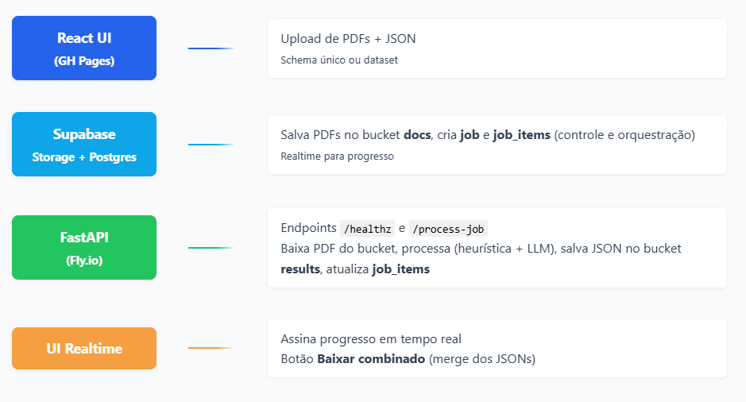
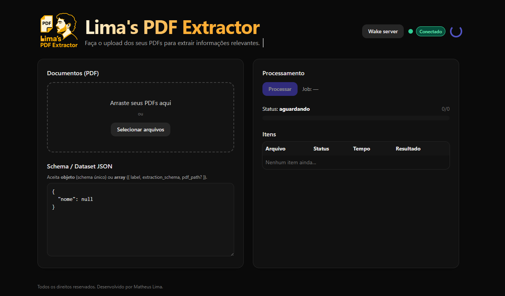

<p align="center">
    <a href="https://matheuslimam.github.io/Take_home_enter" target="_blank">
        
        <br />
        <b style="color: #ffb301;">Clique aqui e Acesse a ferramenta</b>
    </a>
</p>

# Lima's PDF Extractor — Enter AI Fellowship Take‑Home

<p align="center">
    <b>Stack principal:</b><br>
    
    
    
    
    
    
    
    
</p>


## ✨ Visão geral

Uma solução ponta‑a‑ponta para **extrair dados estruturados de PDFs (1 página, com OCR embutido)**, recebendo `(label, extraction_schema, pdf)` e retornando um **JSON** com os campos. O projeto prioriza **tempo < 10s**, **baixo custo** e **acurácia/consistência** com uma pipeline híbrida de **heurísticas geométricas + LLM como fallback inteligente**.

* **Frontend (GH Pages)**: UI em React que faz upload em lote, associa **schema↔arquivo** por nome/ordem, cria o *job* no Supabase, acompanha o progresso em tempo real e permite **baixar o JSON combinado**.
* **Backend (Fly.io)**: FastAPI que processa cada PDF: baixa do bucket, roda a pipeline de extração e sobe o JSON de saída para o bucket de resultados.
* **Supabase**: armazena **jobs/job_items** (controle de orquestração), dois buckets (`docs` e `results`) e **realtime** para progresso.

---

## 🧠 Abordagem de extração (o “como”)

A pipeline aplica **três estágios** com foco em custo/perf:

1. **Âncoras + leitura local (heurístico)** — `anchors_reading_span.py`

   * O algoritmo gera variações do rótulo do campo (normalização, abreviações, *prefix cuts*, sem vogais) para encontrar **âncoras** no layout do documento.
   * Utiliza "vetores" de texto para comparar proximidade cosseno entre **âncoras** e **campos** (Palavras próximas, compostas ou simples), permitindo busca semântica e maior flexibilidade na identificação, mesmo com pequenas diferenças ou erros de digitação. Essa etapa ocorre em milesimos de segundos e tem uma acuracia média de 80% dos casos testados.
   * A partir da âncora localizada, extrai um **span de leitura** (direita/abaixo), respeitando limites de largura/altura, saltos de linha e tolerância vertical.
   * **Fast‑paths** sem LLM: utiliza regex para identificar padrões comuns como telefone, números de inscrição, CPF e datas. Mas evitando uso de dicionários especificos para deixar completament genérico.
* Resultado: valor bruto por campo, com limpeza (`sanitize_value_text`). Segue uma imagem de um exemplo que rodei somente nessa etapa:

    <p align="center">
        
    </p>

2. **LLM em lote por página**

   * Um único *prompt* passa **todos os campos da página** para **sanitizar e preencher apenas o que faltar** (responde `null` se ausente).
   * Limites rígidos de texto (cortes de contexto) e `max_output_tokens` mínimo.

3. **LLM “JSON extractor” final**

   * No texto completo (compactado) do doc, pede **somente** o JSON do schema **apenas para chaves faltantes** ou **componentes compostos**.
   * Saída é *parsed* e aplicada campo‑a‑campo, sem inventar valores (mantém `null`).

**Por que isso atende ao desafio**

* **<10s**: Heurísticas são O(1)/O(n) no nº de *tokens* de texto; LLM é **fallback** limitado, com *caps* e *early exits*.
* **Custo baixo**: regex + layout evitam chamadas; quando LLM é usado, é **bulk** e recortado.
* **Acurácia ≥ 80%**: mistura de **âncora geométrica** + **sanitização por LLM** lida com layouts que variam sem depender de *templates* fixos.

> Código principal da pipeline: `worker/anchors_reading_span.py` (usado também no backend).

---

## 🏗️ Arquitetura
<div align="center">

<!-- Mapa mental da arquitetura: Lima's PDF Extractor -->


</div>

---

## 🗃️ Modelo de dados (Supabase)

Tabelas (chaves mínimas):

```sql
CREATE TABLE public.jobs (
  id uuid PRIMARY KEY DEFAULT gen_random_uuid(),
  created_at timestamptz NOT NULL DEFAULT now(),
  created_by text,
  status text NOT NULL DEFAULT 'queued',
  total_count int NOT NULL DEFAULT 0,
  done_count int NOT NULL DEFAULT 0,
  error_count int NOT NULL DEFAULT 0,
  result_manifest jsonb,
  error_message text
);

CREATE TABLE public.job_items (
  id uuid PRIMARY KEY DEFAULT gen_random_uuid(),
  job_id uuid REFERENCES public.jobs(id),
  created_at timestamptz NOT NULL DEFAULT now(),
  file_name text NOT NULL,
  file_path text NOT NULL,
  status text NOT NULL DEFAULT 'queued',
  duration_ms int,
  result_path text,
  error_message text,
  schema jsonb
);
```

Buckets de Storage:

* `docs` (entrada; PDFs) — público para leitura via serviço; *upload* feito pelo frontend (anon key).
* `results` (saída; JSONs) — pode ser público para facilitar *download* direto pela UI (ou privado + URL assinada).

---

## 🔌 API do backend (FastAPI em Fly)

**Endpoints**

* `GET /healthz` → `{ ok: true }` (usado pelo botão “Wake server” da UI).
* `POST /process-job { job_id }` → dispara processamento do *job*.

**Segurança**

* Versão simples: `app.py` (usa `run_job_id` síncrono; sem header secreto — ideal para o take‑home/POC).
* Versão protegida/concorrente: `main.py` (aceita `x-worker-secret`, *async* com `concurrency=3`, ajustável para `1` se quiser 100% serial).

**Variáveis de ambiente (backend)**

* `SUPABASE_URL`, `SUPABASE_SERVICE_ROLE_KEY`
* `BUCKET_DOCS=docs`, `BUCKET_RESULTS=results`
* `WORKER_SECRET` (se usar `main.py`)
* `OPENAI_API_KEY`

Rodando local:

```bash
# Python 3.11+
python -m venv .venv && source .venv/bin/activate  # (Windows: .venv\Scripts\activate)
pip install -r requirements.txt

# Escolha 1: versão simples
uvicorn app:app --reload --port 8000
# Escolha 2: versão com secret/concurrency
export WORKER_SECRET=devsecret
uvicorn main:app --reload --port 8000
```

Deploy no Fly.io (resumo):

```bash
fly launch --no-deploy  # cria o app e o fly.toml
# Secrets
fly secrets set SUPABASE_URL=... SUPABASE_SERVICE_ROLE_KEY=... \
  BUCKET_DOCS=docs BUCKET_RESULTS=results OPENAI_API_KEY=... \
  WORKER_SECRET=...  # se usar main.py
fly deploy
```

> A UI aponta para `VITE_FLY_API_URL` (ex.: `https://take-home-enter.fly.dev`).

---

## 🖥️ Frontend (React + Vite + Tailwind)

<p align="center">
    
    <br />
    <em>Exemplo da interface: upload em lote, mapeamento de schema, progresso e download.</em>
</p>

**Principais recursos**

> ⚠️ **Aviso:** Existem **3 formas de aquecer o servidor** antes de processar os PDFs, pode demorar um pouco (média de 8s) para iniciar a queue:
> 1. Clicar no botão **Wake server** na interface (recomendada).
> 2. Quando colocamos um documento.
> 3. Realizar qualquer requisição para o backend (ex.: iniciar um job).
> Isso garante que o backend esteja ativo e pronto para receber os arquivos.

* **Upload em lote** (drag & drop).
* Campo JSON aceita:

  * **schema único** `{ "campo": null, ... }`, aplicado a todos os PDFs; ou
  * **dataset** `[{ label, extraction_schema, pdf_path? }]` e a UI faz *matching* **por nome** (`pdf_path`) ou **por ordem**.
* **Preview do mapeamento** com *badges* (`filename`, `ordem`, `schema único`) e alertas se houve *fallback* por ordem.
* **Progresso em tempo real** (Supabase Realtime), **média por PDF** ao terminar e **download do combinado**.
* **Wake server** + *status badge* (ok/conectando/erro).

**Variáveis de ambiente (frontend)**

* `VITE_SUPABASE_URL`
* `VITE_SUPABASE_ANON_KEY`
* `VITE_FLY_API_URL` (URL do backend)

Rodando local:

```bash
cd frontend
npm i
npm run dev  # http://localhost:5173
```

Deploy no GitHub Pages:

1. Habilite **Pages** (branch `gh-pages` ou via *workflow* `frontend/.github/workflows/pages.yaml`).
2. Configure `homepage`/`base` no Vite se o repositório for *user/Take_home_enter* (o workflow já trata caminhos relativos).
3. Exporte `VITE_SUPABASE_URL`, `VITE_SUPABASE_ANON_KEY`, `VITE_FLY_API_URL` como **secrets** do repositório (se necessário para *build*).

---

## ⚙️ Como usar (end‑to‑end)

### Usando a UI

1. Acesse: [https://matheuslimam.github.io/Take_home_enter](https://matheuslimam.github.io/Take_home_enter)
2. Na interface, **cole um JSON** de schema (único ou dataset) e **arraste os PDFs** desejados.
3. Clique em **Processar**: a UI cria o `job` e os `job_items`, faz upload dos PDFs para o bucket `docs/` e aciona o backend via `/process-job`.
4. Acompanhe o **progresso em tempo real**; ao finalizar, utilize o botão **Baixar combinado** para obter um arquivo `job-<id>-combined.json` com `{ file, result }` para cada PDF processado.


### Exemplos de schema (dataset)

```json
[
  {
    "label": "carteira_oab",
    "extraction_schema": {
      "nome": "Nome do profissional...",
      "inscricao": "Número de inscrição...",
      "seccional": "UF...",
      "situacao": "Situação do profissional..."
    },
    "pdf_path": "oab_1.pdf"
  },
  {
    "label": "carteira_oab",
    "extraction_schema": {
      "nome": null,
      "inscricao": null,
      "seccional": null,
      "situacao": null
    },
    "pdf_path": "oab_2.pdf"
  }
]
```

---

## 🔬 Decisões e trade‑offs

* **LLM como “último recurso”**: heurísticas + regex resolvem a maior parte; LLM limpa/preenche apenas quando necessário (e em **lote** para reduzir custo).
* **Contexto mínimo**: cortes de texto (limites por página e total), *caps* de *tokens* de saída.
* **Variabilidade de layout**: busca por **âncoras genéricas** caso o rótulo não seja exatamente igual ao nome da chave, com pontuação e repulsão de colisão de *bboxes*.
* **Serial vs. concorrente**: `run_job.py` processa **sequencialmente**; `main.py` permite **concurrency** (padrão 3) para melhorar *latência média*. Pode ser `1` se a avaliação exigir série estrita.
* **Custo**: uma chamada bulk + um *extractor* final somente quando há falta/ambiguidade — otimizando *upper bound* do custo por documento.

---

## 📈 Métricas visíveis na UI

* **Status por item** (queued/running/done/error).
* **Tempo por item** (`duration_ms`).
* **Média por PDF** ao final do job.

> A UI calcula a média apenas dos itens `done` com `duration_ms` definido e exibe com precisão de segundos.

---

## 🔐 Segurança e boas práticas

* **Service Role Key** só no **backend** (Fly). O frontend usa **anon key**.
* Habilite **RLS** nas tabelas e use **Policies** para restringir `insert/select/update` pelos usuários do app (não incluso por brevidade; recomendável em produção).
* Se `results` for privado, gere **URLs assinadas** para baixar o JSON.
* Para `main.py`, configure header `x-worker-secret` no caller (UI/Edge) e **não exponha** esse secret no cliente público.

---

## 🧪 Testes locais com o dataset público

Se a UI, não funcionar de alguma forma, apresentar lentidão ou está sem internet.
* Baixe o repositório com PDFs de exemplo do desafio.
* Monte um **dataset JSON** (array) apontando `pdf_path` para cada arquivo do diretório local e teste com `anchors_reading_span.py` (modo CLI) ou pela UI.

Execução CLI

```bash
python worker/anchors_reading_span.py  # lê dataset3.json/Data/pdfs e imprime JSON final
```

---

## 📂 Estrutura relevante do repo

```
.
├─ frontend/                   # React + Vite + Tailwind (UI GH Pages)
│  ├─ src/App.tsx              # UI (upload, mapping, progresso, média, download)
│  └─ src/lib/supabase.ts      # cliente supabase (anon)
├─ worker/
│  ├─ anchors_reading_span.py  # heurísticas + LLM fallback + extractor JSON
│  ├─ run_job.py               # execução sequencial por job_item
│  └─ main.py                  # FastAPI async (secret + concurrency)
├─ app.py                      # FastAPI simples (sem segredo, síncrono)
├─ requirements.txt            # deps Python
├─ fly.toml                    # config Fly
└─ README.md                   # este arquivo
```

---

## 📝 Checklist de entrega

* [x] Recebe `(label, schema, pdf)` e retorna JSON
* [x] Responde em <10s (média) com custos reduzidos (LLM mínimo, heurísticas primeiro)
* [x] UI funcional com progresso em tempo real + download de resultados
* [x] Execução em lote a partir de uma lista (dataset) ou schema único
* [x] Deploy: **Frontend em GitHub Pages** e **Backend em Fly.io**

---

## 🛠️ Troubleshooting


---

## 📣 Créditos

Desenvolvido por **Matheus Lima** — *Lima's PDF Extractor*. Obrigado por avaliar! 🙌
